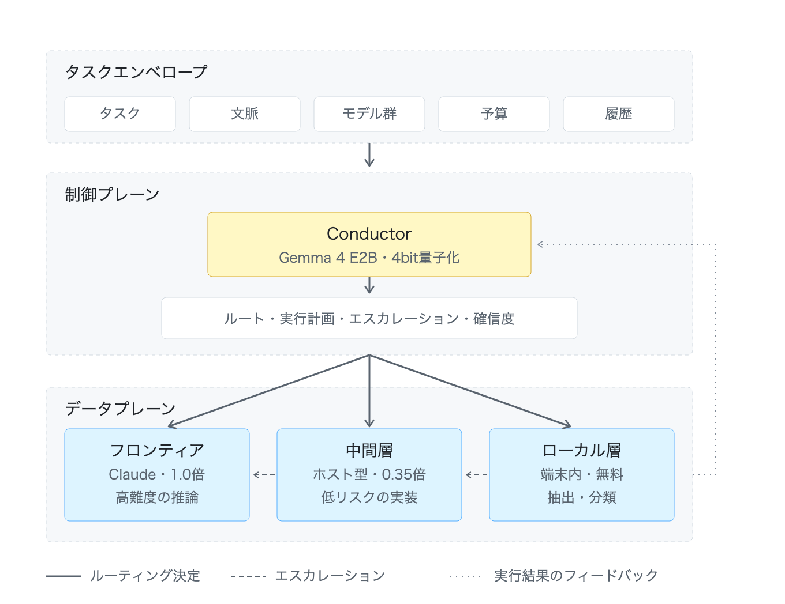

# Conductor

**異種混成 LLM 群のコストを考慮したオーケストレーションのための小規模言語モデル**

[English](README.md) · **日本語**

> ステータス: ステージ 0 の学習と評価が完了（§6.1） · v0.1 · 2026-08

---

## 概要

今日のエージェントシステムは、単一のモデルではなく複数のモデル群（フリート）の上で動作するようになってきている。正確性が要求される推論にはフロンティアのホスト型モデル（Claude など）、定型的な文書作成や低リスクなコードには中間層のホスト型モデル、軽量・機密・大量処理にはローカルのオープンウェイトモデル、という使い分けである。しかし現在、これらの層の間のルーティングは静的な手書きルールによって決められている。

本プロジェクトが提案する **Conductor** は、制御プレーンのみを担う小規模なオーケストレータ言語モデルである。タスク、その文脈、および利用可能な実行モデルのレジストリを与えられると、Conductor は構造化されたルーティング決定 — 対象モデル、タスク分解、エスカレーション方針、確信度 — をスキーマ制約付き JSON として出力する。

本研究の仮説は、オーケストレーションのトレースでファインチューニングした約 2B パラメータのモデルが、手書きのルーティング経験則と同等以上の性能を達成しつつ、静的ルールでは表現できない信号（タスクの曖昧さ、文脈長、過去の失敗履歴）にも適応できるということである。まず **Gemma 4 E2B** をベースとした家庭規模のプロトタイプから着手し、有効性が確認できれば同じレシピを **DGX Spark 上で社内運用する 7B 級モデル**へとスケールさせる。

---

## 1. 動機

エージェントのシステムプロンプトに書き込まれるような静的な階層化ポリシーには、構造的な弱点が三つある。

1. **脆弱性。** ルールは想定されたタスク形状に対して書かれる。しかし実際のワークロードには層をまたぐタスク（「機械的なリファクタリングだが、セキュリティ上重要なファイル内」など）が含まれ、例外が積み上がるにつれてルール一覧は単調に膨張していく。
2. **結果から学習しない。** 中間層のモデルが失敗してタスクがエスカレーションされたとき、その信号は捨てられる。学習型ルータであれば、*どのような*タスク特徴が各層での失敗を予測するのかを内在化できる。
3. **ルーティング自体がフロンティアのトークンを消費する。** フロンティアモデル自身がルーティングを行う場合（タスクを読み、委任を判断する）、その判断にフロンティアモデルのトークンとレイテンシがかかる。専用の小規模ルータであれば、ローカル推論のコストで判断を下し、フロンティアモデルを実行のみに使える。

経済的な論拠は単純である。エージェントのワークロードのうち相当な割合を、トークン単価が 10〜100 分の 1 のモデルに振り分けられるなら、誤ルーティング率（下流で失敗しエスカレーションを要するタスクの割合）がコスト比を下回っている限り、ルータはそのコストを回収する。したがってルータ自身は小さく、速く、安価でなければならない — これがルータをフロンティアモデルに*しない*理由そのものである。

## 2. 関連研究

- **学習型 LLM ルーティング。** RouteLLM (Ong et al., 2024) は選好データから強／弱の二値ルータを学習する。FrugalGPT (Chen et al., 2023) は逐次フォールバックを伴う LLM カスケードを扱う。Hybrid LLM (Ding et al., 2024) は予測されたクエリ難易度でルーティングする。Conductor はこの二値設定を *N* 層かつツールを考慮したフリートへ一般化し、スカラー的な選択ではなく完全な実行計画を出力する。
- **カスケードと投機的実行。** カスケード方式は安価なモデルを先に試して検証する。投機的デコーディングはトークン単位で同種のことを行う。対して Conductor は事前に決定を下すが、明示的なエスカレーション方針を付随させることで、予測型ルーティングとカスケード型の復旧を組み合わせる。
- **オーケストレーションフレームワーク。** エージェントフレームワーク（マルチエージェントランタイム、MCP ベースのツールルータ）は委任の*機構*を提供するが、*方針*は通常プロンプトで与えられ、学習されていない。Conductor はそうした機構に差し込める学習済み方針である。
- **小規模モデルの特化。** タスク特化の小規模モデルは、出力形式が限定された狭いタスクにおいて、はるかに大きな汎用モデルを日常的に上回る。ルーティングは出力スキーマが閉じた狭いタスクであり、2B モデルにとって有利な設定である。

## 3. システム構成

Conductor は**制御プレーン**の構成要素である。タスクを実行することはなく、利用者に見えるコンテンツを生成することもない。タスクエンベロープを読み、ルーティング決定を書くだけである。実行は**データプレーン**（Claude、中間層のホスト型モデル、ローカルモデル、各種ツール）で行われる。

<p align="center">
  <picture>
    <source media="(prefers-color-scheme: dark)" srcset="docs/architecture.ja-dark.png">
    
  </picture>
</p>

<p align="center"><em>図 1 — Conductor は完全に制御プレーンに属する。決定は下すが、実行はしない。</em></p>

エンベロープはタスク本文、文脈の要約、フリートのレジストリ、予算の状態、そして失敗履歴を運ぶ。Conductor は層の選択、タスク分解、エスカレーション方針、確信度をスキーマ制約付き JSON として出力する。実行結果は学習信号として戻ってくる（§5 ステージ 2）。

両図のベクタ形式ソース: [architecture.ja.svg](docs/architecture.ja.svg) ·
[architecture.svg](docs/architecture.svg)（英語版）。PNG はライト／ダーク両方を用意しており、
閲覧者のテーマに応じて自動的に切り替わる。

### 3.1 入力: タスクエンベロープ

```jsonc
{
  "task": "添付された 40k トークンのログを要約し、エラーの特徴を抽出する",
  "context": { "tokens_est": 41200, "domain": "devops", "artifacts": ["file"] },
  "fleet": [
    { "id": "claude-opus",  "tier": "frontier", "cost": 1.00, "caps": ["reasoning","code","long-ctx"] },
    { "id": "sonnet",       "tier": "mid",      "cost": 0.35, "caps": ["drafting","code-lite"] },
    { "id": "local-2b",     "tier": "local",    "cost": 0.00, "caps": ["summarize","classify","extract"] }
  ],
  "budget": { "frontier_tokens_remaining": 0.42 },
  "history": [ { "task_class": "summarize-log", "tier": "local", "outcome": "ok" } ]
}
```

### 3.2 出力: ルーティング決定

```jsonc
{
  "route": "local-2b",
  "plan": [
    { "step": "chunk+summarize", "route": "local-2b" },
    { "step": "merge summaries + extract signatures", "route": "local-2b" }
  ],
  "escalation": { "on": ["schema_invalid", "self_reported_uncertainty>0.5"], "to": "sonnet" },
  "confidence": 0.86,
  "rationale_class": "high-volume extractive task; local capable per history"
}
```

出力は制約付きデコーディングのもとで JSON Schema に対して検証される。不正な決定はそれ自体がエスカレーションの契機となる（フェイルセーフ: 最上位層へルーティングする）。

### 3.3 設計原則

- **上へ倒れ、下へは倒れない。** 制御プレーン内のあらゆる不確実性は、より高性能な層の側へ解決される。Conductor の失敗形態は*より多く支出すること*であるべきで、*黙ってより低品質な出力を出すこと*であってはならない。
- **決定は監査可能である。** すべての決定は閉じた語彙から選ばれた `rationale_class` を持つ。これによりルーティング挙動が計測可能かつデバッグ可能になる — 実行経路上に自由記述の理由文は置かない。
- **ルータは状態を持たず、ハーネスが持つ。** 予算の状態、失敗履歴、フリートのレジストリは呼び出しごとに与えられる。これによりモデルは差し替え可能に、システムは検査可能に保たれる。

## 4. モデル

| | 家庭用プロトタイプ | 社内運用 |
|---|---|---|
| ベースモデル | **Gemma 4 E2B**（MatFormer、実効約 2B） | 7〜8B 級（Gemma 4 E8B 相当） |
| ファインチューニング | QLoRA（コンシューマ GPU 1 枚、RTX 3080 級） | DGX Spark 上で全パラメータまたは LoRA |
| 推論提供 | Apple Silicon 上の LM Studio / MLX | DGX Spark（GB10、統合メモリ 128 GB）— vLLM / TensorRT-LLM |
| 量子化 | 4bit（GGUF / MLX） | FP8 / INT4-AWQ |
| 目標判断レイテンシ | エンドツーエンドで 500 ms 未満 | エンドツーエンドで 200 ms 未満 |

家庭用の層に Gemma 4 E2B を選んだ理由は、MatFormer アーキテクチャにより実効パラメータ規模が小さいまま強い指示追従性が得られること、Apple Silicon とコンシューマ GPU の双方で余裕をもって動作すること、そしてライセンスがファインチューニング済みモデルの再配布を許可していることである。社内向けの 7B 版は*同一のデータレシピとスキーマ*を用いる。スケールアップは容量の変更であり、設計の変更ではない。

## 5. 学習手法

四つのステージから成り、それぞれ独立に評価できる。

**ステージ 0 — スキーマの習得（合成データによる SFT）。** ルーティング分類体系（タスク種別 × 文脈長 × フリート構成 × 予算状態）を網羅するタスクエンベロープをプログラムで生成し、ルールから導出した正解決定を付与する。出力スキーマと自明なケースを教える段階である。5〜10 万件程度、生成コストは低い。

**ステージ 1 — トレース蒸留（SFT）。** フロンティアモデルが実際にオーケストレーションを行ったエージェントセッション（委任の判断、層の選択、エスカレーション）からルーティング決定を収集し、エンベロープ→決定の対に変換する。これによりフロンティアのルーティング判断を小規模モデルへ蒸留する。データ源は計装したエージェントハーネスのログ（例: MCP オフロードツールの呼び出し箇所とその周辺文脈）。

**ステージ 2 — 結果に基づく選好最適化（DPO）。** 記録された結果から対を構成する。すなわち同等のエンベロープに対して、下流の実行が成功した決定を、エスカレーションを要した決定や却下された出力を生んだ決定よりも選好する。静的ルールでは再現できないのがこの段階であり、モデルは*タスク特徴 → 各層での失敗確率*という構造を学習する。

**ステージ 3 — オンライン改良（任意）。** 新しい結果ログでの定期的な再学習。必要なフィードバックは運用ループがすでに捕捉している（§3 の実行結果フィードバックの矢印）。ステージ 0〜2 の有効性が確認されるまでは明示的に対象外とする。

### 5.1 データの取り扱い

- エンベロープは文脈の*要約*であり、生の利用者コンテンツを含まない。これにより学習コーパスに機密データが混入しない。
- 結果ラベルは機械的な信号のみを用いる（スキーマの妥当性、エスカレーションの発生、テストの合否、編集の却下）。v1 では LLM による判定ラベルを使わない。判定側のバイアスをルータへ蒸留してしまうのを避けるためである。

## 6. 評価プロトコル

| 指標 | 定義 | 上回るべきベースライン |
|---|---|---|
| ルーティング正解率 | 検証用エンベロープに対するオラクル（結果再生に基づく最適層）との一致率 | 静的ルール一覧 |
| 同品質時のコスト | 下流タスクの成功率を揃えたときのフリート総支出 | フロンティア専用、静的ルール |
| エスカレーションの適合率／再現率 | 危険と予測したタスクのうち実際に下流で失敗した割合、およびその逆 | カスケード（常に安価な層から試す） |
| スキーマ妥当性 | 制約付きデコーディング下で整形式な決定の割合 | —（ほぼ 100% であること） |
| 判断レイテンシ | エンベロープ入力から決定出力まで、p50／p95 | 家庭用 500 ms 未満 / Spark 200 ms 未満 |

ルータが有用であるのは `(誤ルーティング率 × エスカレーションコスト) + ルータのコスト < 正しい下位振り分けによる節約` が成り立つ場合のみである。評価ハーネスはこの純節約額をワークロード構成ごとに直接算出する。

### 6.1 ステージ 0 の結果（Conductor-E2B v0）

Gemma 4 E2B、QLoRA（r=16、4bit nf4、学習対象 2,420 万パラメータ）、合成エンベロープ 12,000 件を
RTX 3080 1 枚で 1 エポック学習。最終的な学習損失 0.0954、検証損失 0.0964。**検証用に分離した
800 件のエンベロープ**で貪欲デコーディングにより評価。正解ラベルは `datagen/policy.py` の
ルールオラクルによる。

| 指標 | 結果 |
|---|---|
| JSON パース成功率 | **100.0%** |
| スキーマ妥当性 | **100.0%** |
| ルートがフリート内の実在モデルを指す割合 | **100.0%** |
| エスカレーション先が厳密に上位である割合 | **100.0%** |
| オラクルとのルート一致率 | 91.4% |
| rationale クラスの一致率 | 90.4% |
| 危険な下位振り分け（より安価な層への誤り） | **4.0%**（32/800） |

構造的な保証は完全に成立した。800 件連続で不正な JSON もスキーマ違反もなく、存在しない
実行モデル ID を生成することもなかった。出力された `escalation.to` はすべて厳密に上位の層を
指していた。

**一方で、主ルートの選択については「上へ倒れる」不変条件がまだ成立していない。** 69 件の
誤ルーティングのうち 37 件は上位方向（無駄だが安全）、32 件は下位方向（危険）であり、その
多くは `frontier → mid`（23 件）であった。この下位方向の誤りは一様には分布しておらず、
**32 件中 30 件が、本来は上位へ振り分けるための条件付き上書きルールに由来する。**

| 危険な下位振り分けの正解 rationale | 件数 |
|---|---|
| `history_failure_escalation` | 17 |
| `long_context_capability_gate` | 7 |
| `capability_gate_local_unfit` | 3 |
| `ambiguity_fail_up` | 2 |
| `fleet_gap_fail_up` | 1 |

モデルはタスク種別による基本的な対応付けは十分に学習した一方で、*条件付き*の上書きルールの
適用が不足している。上書きを見落とすとタスク種別の既定層へ戻ってしまい、それは常により
下位の層である。中でも失敗履歴の信号が突出して弱い。これはステージ 0 としては当然の結果でも
ある。「この層は以前失敗した」というルールの模倣は、まさに結果に基づく学習（§5 ステージ 2）が
供給すべきパターンだからである。

ここから設計上の含意が二つ得られる。第一に、ステージ 0 の合成データでは、構造上どうしても
少数になる上書きケースを意図的に多くサンプリングすべきである。第二に、より本質的な点として、
「上へ倒れる」不変条件はモデルが学習していることに期待するのではなく、推論提供層で決定論的に
強制すべきである。学習型ルータが提案し、小さな決定論的ガードがハードな制約に違反する
ルートを却下する。危険な下位振り分け率 4% は*提案*としては許容できるが、最終決定としては
許容できない。

## 7. 運用対象

**フェーズ A — 家庭環境（検証）。** Apple Silicon 上の LM Studio または MLX で Conductor-E2B を提供し、{API 経由の Claude、ホスト型の中間層、ローカルの 2B〜8B モデル} から成るフリートの前段に置く。MCP サーバー／OpenAI 互換エンドポイントとして統合することで、既存のエージェントハーネスを改変せずに導入できる。

**フェーズ B — 社内環境（DGX Spark）。** DGX Spark（GB10 Grace Blackwell、統合メモリ 128 GB）上の Conductor-7B が、社内の開発ワークロードに対してルーティング決定を提供する。Spark のメモリ容量であればルータと複数のローカル実行モデルを同時常駐させられるため、ローカル層全体を 1 台に収められる。

## 8. ロードマップ

- **P0 — 仕様策定。** 決定スキーマ v0、ルーティング分類体系、`rationale_class` 語彙を確定する。
- **P1 — データパイプライン。** 合成エンベロープ生成器、実セッションからのトレース収集の計装。
- **P2 — Conductor-E2B v0。** ステージ 0+1 の QLoRA ファインチューニング、スキーマ妥当性とルーティング正解率の評価。
- **P3 — ハーネス統合。** MCP サーバー + OpenAI 互換エンドポイント、既存の静的ルールと並走させるシャドーモード運用（決定を記録するが実行には反映しない）。
- **P4 — 評価スイート。** オラクル再生、純節約額の算出、ベースライン比較。
- **P5 — 結果に基づく DPO。** シャドーモードと実運用ログを用いたステージ 2 の学習。
- **P6 — Conductor-7B。** スケールアップ学習と DGX Spark 上での TensorRT-LLM / vLLM 運用。
- **P7 — オンライン改良。** フリートのテレメトリからの定期再学習ループ。

## 9. リポジトリ構成（予定）

```
conductor-lm/
├── spec/          # 決定スキーマ（JSON Schema）、ルーティング分類体系、rationale クラス
├── datagen/       # 合成エンベロープ生成（ステージ 0）
├── harvest/       # トレース収集とエンベロープ変換（ステージ 1）
├── train/         # QLoRA / DPO のレシピと設定
├── serve/         # MCP サーバー + OpenAI 互換シム、制約付きデコーディング
├── eval/          # オラクル再生、純節約額ハーネス、ベースライン
└── docs/          # 設計メモと実験レポート
```

## 10. ライセンス

MIT — [LICENSE](LICENSE) を参照。

## 引用

```bibtex
@misc{conductor2026,
  title  = {Conductor: A Small Language Model for Cost-Aware Orchestration of Heterogeneous LLM Fleets},
  author = {jonpol01},
  year   = {2026},
  url    = {https://github.com/jonpol01/conductor-lm}
}
```
