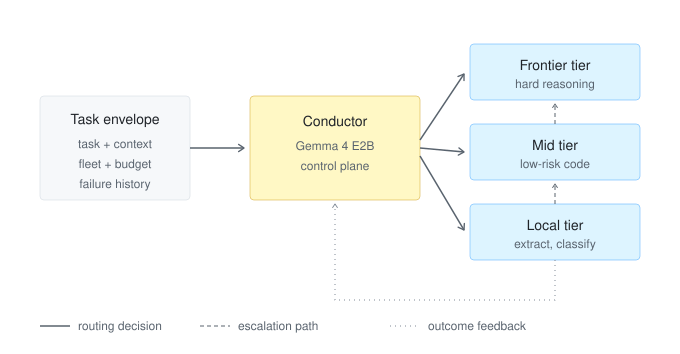

# Conductor

**A Small Language Model for Cost-Aware Orchestration of Heterogeneous LLM Fleets**

> Status: research design / pre-implementation · v0.1 · 2026-07

---

## Abstract

Modern agentic systems increasingly run on a *fleet* of language models rather than a single one: frontier hosted models (e.g. Claude) for correctness-critical reasoning, mid-tier hosted models for routine drafting and low-risk code, and local open-weight models for light, private, or high-volume work. Today the routing between these tiers is governed by static, hand-written rules. This project proposes **Conductor**, a small orchestrator language model whose *only* job is the control plane: given a task, its context, and a registry of available executors, Conductor emits a structured routing decision — target model, task decomposition, escalation policy, and confidence — as constrained JSON. We hypothesize that a ~2B-parameter model fine-tuned on orchestration traces can match or exceed hand-written routing heuristics while adapting to signals (task ambiguity, context size, failure history) that static rules cannot express. We begin with a home-scale prototype based on **Gemma 4 E2B** and, if validated, scale the same recipe to a **~7B-class model deployed internally on a DGX Spark**.

---

## 1. Motivation

Static tiering policies (of the kind commonly written into agent system prompts) have three structural weaknesses:

1. **Brittleness.** Rules are written for anticipated task shapes. Real workloads contain tasks that straddle tiers ("mechanical refactor, but in a security-sensitive file"), and rule lists grow monotonically as exceptions accumulate.
2. **No learning from outcomes.** When a mid-tier model fails and the task escalates, that signal is discarded. A learned router can internalize *which* task features predict failure at each tier.
3. **Routing consumes frontier tokens.** When the frontier model itself performs the routing (reading the task, deciding to delegate), the decision costs frontier-model tokens and latency. A dedicated small router makes the decision at local-inference cost, reserving the frontier model for execution only.

The economic argument is direct: if a meaningful fraction of an agentic workload is routable to models that cost 10–100× less per token, the router pays for itself as long as its misroute rate (tasks that fail downstream and require escalation) stays below the cost ratio. The router itself must therefore be small, fast, and cheap — which is exactly why it is *not* a frontier model.

## 2. Related Work

- **Learned LLM routing.** RouteLLM (Ong et al., 2024) trains binary strong/weak routers from preference data; FrugalGPT (Chen et al., 2023) studies LLM cascades with sequential fallback; Hybrid LLM (Ding et al., 2024) routes on predicted query difficulty. Conductor generalizes the binary setting to an *N*-tier, tool-aware fleet, and outputs a full execution plan rather than a scalar choice.
- **Cascades and speculative execution.** Cascade systems try the cheap model first and verify; speculative decoding does the analogous thing token-level. Conductor instead makes an *a priori* decision but attaches an explicit escalation policy, blending predictive routing with cascade-style recovery.
- **Orchestration frameworks.** Agent frameworks (multi-agent runtimes, MCP-based tool routers) supply the *mechanism* for delegation; the *policy* is typically prompted, not learned. Conductor is a drop-in learned policy for such mechanisms.
- **Small-model specialization.** Task-specific small models routinely beat much larger generalists on narrow structured-output tasks. Routing is a narrow task with a closed output schema — a favorable setting for a 2B model.

## 3. System Architecture

Conductor is a **control-plane** component. It never executes tasks and never generates user-facing content; it reads a task envelope and writes a routing decision. Execution happens in the **data plane** (Claude, mid-tier hosted models, local models, tools).

<p align="center"></p>

The envelope carries the task text, a context summary, the fleet registry, budget state, and
failure history. Conductor emits tier selection, decomposition, escalation policy, and
confidence as constrained JSON. Execution outcomes return as training signal (§5, Stage 2).

### 3.1 Input: task envelope

```jsonc
{
  "task": "Summarize the attached 40k-token log and extract error signatures",
  "context": { "tokens_est": 41200, "domain": "devops", "artifacts": ["file"] },
  "fleet": [
    { "id": "claude-opus",  "tier": "frontier", "cost": 1.00, "caps": ["reasoning","code","long-ctx"] },
    { "id": "sonnet",       "tier": "mid",      "cost": 0.35, "caps": ["drafting","code-lite"] },
    { "id": "local-2b",     "tier": "local",    "cost": 0.00, "caps": ["summarize","classify","extract"] }
  ],
  "budget": { "frontier_tokens_remaining": 0.42 },
  "history": [ { "task_class": "summarize-log", "tier": "local", "outcome": "ok" } ]
}
```

### 3.2 Output: routing decision

```jsonc
{
  "route": "local-2b",
  "plan": [
    { "step": "chunk+summarize", "route": "local-2b" },
    { "step": "merge summaries + extract signatures", "route": "local-2b" }
  ],
  "escalation": { "on": ["schema_invalid", "self_reported_uncertainty>0.5"], "to": "sonnet" },
  "confidence": 0.86,
  "rationale_class": "high-volume extractive task; local capable per history"
}
```

The output is validated against a JSON Schema with constrained decoding; an invalid decision is itself an escalation trigger (fail-safe: route to the highest tier).

### 3.3 Design principles

- **Fail up, never down.** Any uncertainty in the control plane resolves toward the more capable tier. The failure mode of Conductor should be *spending more*, never *silently producing worse output*.
- **Decisions are auditable.** Every decision carries a `rationale_class` from a closed vocabulary, making routing behavior measurable and debuggable — no free-text rationales in the hot path.
- **The router is stateless; the harness is not.** Budget state, failure history, and fleet registry are supplied per call. This keeps the model swappable and the system inspectable.

## 4. Model

| | Home prototype | Internal deployment |
|---|---|---|
| Base model | **Gemma 4 E2B** (MatFormer, ~2B effective) | ~7–8B class (Gemma 4 E8B or equivalent) |
| Fine-tuning | QLoRA (single consumer GPU, RTX 3080-class) | Full-parameter or LoRA on DGX Spark |
| Serving | LM Studio / MLX on Apple Silicon | DGX Spark (GB10, 128 GB unified) — vLLM / TensorRT-LLM |
| Quantization | 4-bit (GGUF / MLX) | FP8 / INT4-AWQ |
| Target decision latency | < 500 ms end-to-end | < 200 ms end-to-end |

Gemma 4 E2B is chosen for the home tier because its MatFormer architecture gives a small effective-parameter footprint with strong instruction-following, it runs comfortably on Apple Silicon and consumer GPUs, and its license permits fine-tuned redistribution. The 7B internal variant uses the *same data recipe and schema* — the scale-up is a capacity change, not a redesign.

## 5. Training Methodology

Four stages, each independently evaluable:

**Stage 0 — Schema grounding (synthetic SFT).** Programmatically generated task envelopes covering the routing taxonomy (task class × context size × fleet composition × budget state), with rule-derived gold decisions. Teaches the output schema and the obvious cases. ~50–100k examples, cheap to produce.

**Stage 1 — Trace distillation (SFT).** Routing decisions harvested from real agentic sessions where a frontier model performed orchestration (delegation decisions, tier choices, escalations), converted into envelope→decision pairs. This distills frontier routing judgment into the small model. Sources: instrumented agent harness logs (e.g. MCP offload-tool call sites and their surrounding context).

**Stage 2 — Outcome-based preference optimization (DPO).** Pairs constructed from logged outcomes: a decision whose downstream execution succeeded is preferred over one that required escalation or produced rejected output, for matched envelopes. This is the stage static rules cannot replicate — the model learns *task-feature → tier-failure-probability* structure.

**Stage 3 — Online refinement (optional).** Periodic re-training on fresh outcome logs; the deployment loop already captures the needed feedback (§3, outcome feedback arrow). Explicitly out of scope until Stages 0–2 validate.

### 5.1 Data hygiene

- Envelopes are *summaries* of context, never raw user content — the training corpus stays free of sensitive payloads.
- Outcome labels use mechanical signals only (schema validity, escalation events, test pass/fail, edit-rejection) — no LLM-judged labels in v1, to avoid distilling judge bias into the router.

## 6. Evaluation Protocol

| Metric | Definition | Baseline to beat |
|---|---|---|
| Routing accuracy | Agreement with oracle (best tier per outcome replay) on held-out envelopes | Static rule list |
| Cost @ iso-quality | Total fleet spend at matched downstream task-success rate | Frontier-only; static rules |
| Escalation precision/recall | Of predicted-risky tasks, how many actually failed downstream (and vice versa) | Cascade (always-try-cheap-first) |
| Schema validity | Well-formed decisions under constrained decoding | — (must be ≈100%) |
| Decision latency | Envelope-in → decision-out, p50/p95 | < 500 ms home / < 200 ms Spark |

A router is only useful if `(misroute rate × escalation cost) + router cost < savings from correct downroutes`; the evaluation harness computes this net-savings figure directly per workload mix.

## 7. Deployment Targets

**Phase A — Home (validation).** Conductor-E2B served via LM Studio or MLX on Apple Silicon, fronting a fleet of {Claude via API, hosted mid-tier, local 2B–8B models}. Integration as an MCP server / OpenAI-compatible endpoint so existing agent harnesses can adopt it without modification.

**Phase B — Internal (DGX Spark).** Conductor-7B on a DGX Spark (GB10 Grace Blackwell, 128 GB unified memory) serving routing decisions for internal engineering workloads. The Spark's memory capacity also allows the router and several local executor models to be co-resident, making the full local tier one box.

## 8. Roadmap

- **P0 — Specification.** Freeze decision schema v0, routing taxonomy, and rationale-class vocabulary.
- **P1 — Data pipeline.** Synthetic envelope generator; trace-harvesting instrumentation for real sessions.
- **P2 — Conductor-E2B v0.** Stage 0+1 QLoRA fine-tune; schema-validity and routing-accuracy evals.
- **P3 — Harness integration.** MCP server + OpenAI-compatible endpoint; shadow-mode deployment (log decisions, don't act on them) alongside the existing static rules.
- **P4 — Evaluation suite.** Oracle replay, net-savings computation, baseline comparisons.
- **P5 — Outcome DPO.** Stage 2 training from shadow-mode + live logs.
- **P6 — Conductor-7B.** Scale-up training and TensorRT-LLM/vLLM deployment on DGX Spark.
- **P7 — Online refinement.** Scheduled re-training loop from fleet telemetry.

## 9. Planned Repository Layout

```
conductor-lm/
├── spec/          # decision schema (JSON Schema), routing taxonomy, rationale classes
├── datagen/       # synthetic envelope generation (Stage 0)
├── harvest/       # trace-harvesting + envelope conversion (Stage 1)
├── train/         # QLoRA / DPO recipes and configs
├── serve/         # MCP server + OpenAI-compatible shim, constrained decoding
├── eval/          # oracle replay, net-savings harness, baselines
└── docs/          # design notes and experiment reports
```

## 10. License

MIT — see [LICENSE](LICENSE).

## Citation

```bibtex
@misc{conductor2026,
  title  = {Conductor: A Small Language Model for Cost-Aware Orchestration of Heterogeneous LLM Fleets},
  author = {jonpol01},
  year   = {2026},
  url    = {https://github.com/jonpol01/conductor-lm}
}
```
